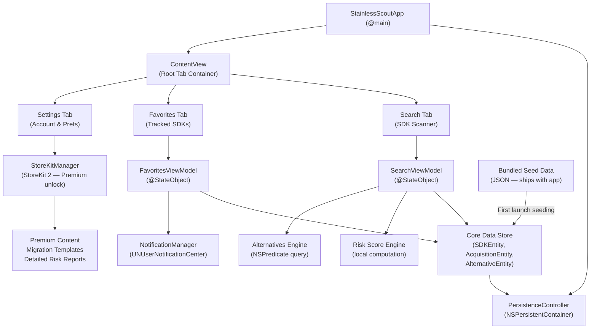
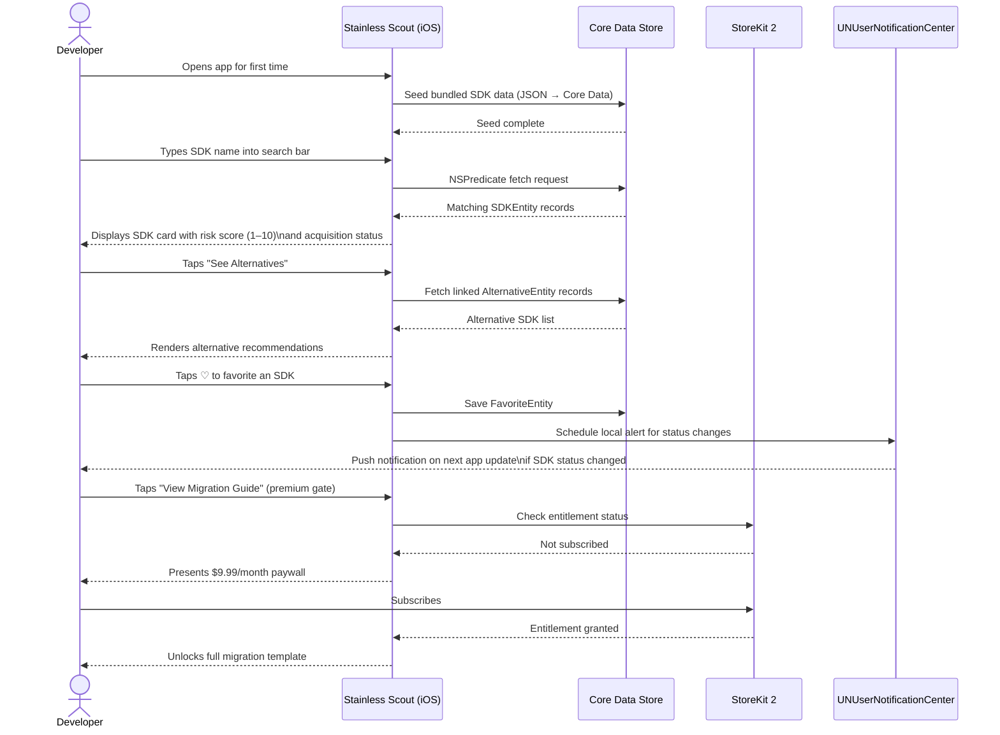

# Stainless Scout

**SDK detective for developers navigating the post-Anthropic acquisition chaos**

Stainless Scout is an iOS app that helps developers instantly assess the stability of their third-party SDK dependencies in a world of accelerating AI company acquisitions and sudden shutdowns. Enter your current tech stack, receive a vulnerability score, and discover vetted alternatives — all offline, in under 60 seconds. A premium tier unlocks real-time local alerts and step-by-step migration templates for $9.99/month.

---

## Features

- **SDK Vulnerability Scanner** — Search a curated local database of popular SDKs and receive a risk score (1–10) based on acquisition history, deprecation signals, and company stability indicators
- **Alternative Recommendations Engine** — Every flagged SDK surfaces hand-curated, safer alternatives so you always have an actionable next step
- **Acquisition Alert System** — Favorite the SDKs you depend on and receive local push notifications when their status changes via app updates
- **Offline-First Design** — The entire database lives on-device via Core Data; no internet connection required for core functionality
- **Premium Migration Templates** — Unlock detailed, step-by-step migration guides for high-risk SDKs with a $9.99/month subscription via StoreKit 2
- **Stack Favorites** — Pin the SDKs you care about most for quick-access monitoring and personalized risk summaries

---

## Tech Stack

### Frontend
| Technology | Version | Notes |
|---|---|---|
| SwiftUI | iOS 17+ | Declarative UI, native dark mode, modern animations |
| StoreKit 2 | iOS 16+ | Native premium subscription management via `async`/`await` |
| UserNotifications | iOS 17+ | Local push alerts for favorited SDK status changes |
| UserDefaults + AppStorage | iOS 17+ | Lightweight user preferences and settings persistence |

### Backend
> No backend required. Stainless Scout is fully offline-first. SDK data is bundled with the app and updated through standard App Store releases.

### Database
| Technology | Version | Notes |
|---|---|---|
| Core Data | iOS 17+ | On-device storage for SDKs, acquisition records, and user favorites |
| NSPredicate + FetchRequest | — | Native Core Data full-text search across SDK records |

### Infrastructure / Tooling
| Technology | Version | Notes |
|---|---|---|
| Xcode | 15.x | Required build tool |
| Swift Package Manager | — | Native dependency management (no third-party packages required) |
| XCTest + XCUITest | Xcode 15 | Unit and UI testing |

---

## Architecture

Stainless Scout follows a clean, offline-first architecture with no network layer. A single `PersistenceController` owns the Core Data stack and is injected into the SwiftUI environment at launch. Feature views consume `@FetchRequest` or `@StateObject` ViewModels that query Core Data directly using `NSPredicate`. StoreKit 2 manages entitlement state locally, and `UserNotifications` schedules local alerts when the user favorites an SDK. All SDK data ships bundled in the app and is seeded into Core Data on first launch.



---

## User Flow



---

## Project Structure

```
StainlessScout/
├── docs/
│   ├── PRD.md                              # Product Requirements Document
│   ├── DESIGN.md                           # Design Brief & visual identity
│   └── ARCHITECTURE.md                     # Technical Architecture Document
│
├── StainlessScout.xcodeproj/
│   └── project.pbxproj
│
├── StainlessScout/
│   │
│   ├── App/
│   │   ├── StainlessScoutApp.swift          # @main entry point, environment setup
│   │   ├── AppDelegate.swift                # UNUserNotificationCenter delegate
│   │   └── ContentView.swift               # Root tab container
│   │
│   ├── Core/
│   │   ├── CoreData/
│   │   │   ├── StainlessScout.xcdatamodeld  # Core Data model (SDKEntity, etc.)
│   │   │   ├── PersistenceController.swift  # NSPersistentContainer setup & seeding
│   │   │   └── CoreDataExtensions.swift     # NSManagedObject convenience helpers
│   │   │
│   │   ├── Models/                          # Swift value-type model structs
│   │   ├── ViewModels/                      # @StateObject ObservableObject classes
│   │   └── Services/
│   │       ├── RiskScoreEngine.swift        # Local vulnerability score computation
│   │       ├── StoreKitManager.swift        # StoreKit 2 subscription management
│   │       └── NotificationManager.swift    # Local push scheduling
│   │
│   ├── Features/
│   │   ├── Search/                          # SDK search & scanner views
│   │   ├── Favorites/                       # Tracked SDKs list & detail
│   │   ├── Detail/                          # SDK detail, risk card, alternatives
│   │   ├── Migration/                       # Premium migration template viewer
│   │   └── Settings/                        # Account, subscription, preferences
│   │
│   ├── Resources/
│   │   ├── SDKSeedData.json                 # Bundled SDK database (shipped with app)
│   │   └── Assets.xcassets                  # Colors, icons, images
│   │
│   └── Supporting Files/
│       ├── Info.plist
│       └── Localizable.strings
│
└── README.md
```

---

## Getting Started

### Prerequisites

- **macOS 14 (Sonoma)** or later
- **Xcode 15.x** — [Download from the Mac App Store](https://apps.apple.com/us/app/xcode/id497799835)
- **iOS 17+ Simulator** or a physical iPhone running iOS 17+
- An **Apple Developer account** (free tier sufficient for Simulator; paid membership required for device deployment and StoreKit sandbox testing)

### Installation

1. **Clone the repository**
   ```bash
   git clone https://github.com/your-org/stainless-scout.git
   cd stainless-scout
   ```

2. **Open the Xcode project**
   ```bash
   open StainlessScout.xcodeproj
   ```

3. **Select your target**
   In Xcode, choose your desired Simulator or connected device from the scheme selector in the toolbar.

4. **Configure signing** *(device only)*
   Navigate to **StainlessScout target → Signing & Capabilities** and select your personal or team Apple Developer account.

### Environment Variables

Stainless Scout requires **no environment variables or `.env` file**. There is no backend, no API keys, and no network configuration. The app is entirely self-contained.

For StoreKit testing in development, configure a local StoreKit configuration file:
1. In Xcode, go to **File → New → File → StoreKit Configuration File**
2. Add your subscription product with ID `com.stainlessscout.premium.monthly`
3. Under **Edit Scheme → Run → Options**, set the **StoreKit Configuration** to your new file

### Running

**Run on Simulator:**
```
Press ▶ (Cmd + R) in Xcode with an iOS 17+ Simulator selected
```

**Run tests:**
```
Press ⌘ + U in Xcode, or from the terminal:
xcodebuild test -scheme StainlessScout -destination 'platform=iOS Simulator,name=iPhone 15 Pro'
```

**Build for release (archive):**
```
Xcode → Product → Archive
```

> **First launch note:** On first run, `PersistenceController` automatically seeds the Core Data store from `SDKSeedData.json`. This takes less than a second and requires no action from the user.

---

## Documentation

Detailed project documentation lives in the `/docs` directory:

| Document | Description |
|---|---|
| [Product Requirements](docs/PRD.md) | Full PRD including goals, user stories, success metrics, and feature specifications |
| [Design Brief](docs/DESIGN.md) | Visual identity, color palette, typography, component guidelines, and mood board references |
| [Architecture](docs/ARCHITECTURE.md) | Technical architecture, data model schema, layer responsibilities, and Core Data entity relationships |

---

## License

This project is licensed under the **MIT License**.

```
MIT License

Copyright (c) 2025 Stainless Scout

Permission is hereby granted, free of charge, to any person obtaining a copy
of this software and associated documentation files (the "Software"), to deal
in the Software without restriction, including without limitation the rights
to use, copy, modify, merge, publish, distribute, sublicense, and/or sell
copies of the Software, and to permit persons to whom the Software is
furnished to do so, subject to the following conditions:

The above copyright notice and this permission notice shall be included in all
copies or substantial portions of the Software.

THE SOFTWARE IS PROVIDED "AS IS", WITHOUT WARRANTY OF ANY KIND, EXPRESS OR
IMPLIED, INCLUDING BUT NOT LIMITED TO THE WARRANTIES OF MERCHANTABILITY,
FITNESS FOR A PARTICULAR PURPOSE AND NONINFRINGEMENT. IN NO EVENT SHALL THE
AUTHORS OR COPYRIGHT HOLDERS BE LIABLE FOR ANY CLAIM, DAMAGES OR OTHER
LIABILITY, WHETHER IN AN ACTION OF CONTRACT, TORT OR OTHERWISE, ARISING FROM,
OUT OF OR IN CONNECTION WITH THE SOFTWARE OR THE USE OR OTHER DEALINGS IN THE
SOFTWARE.